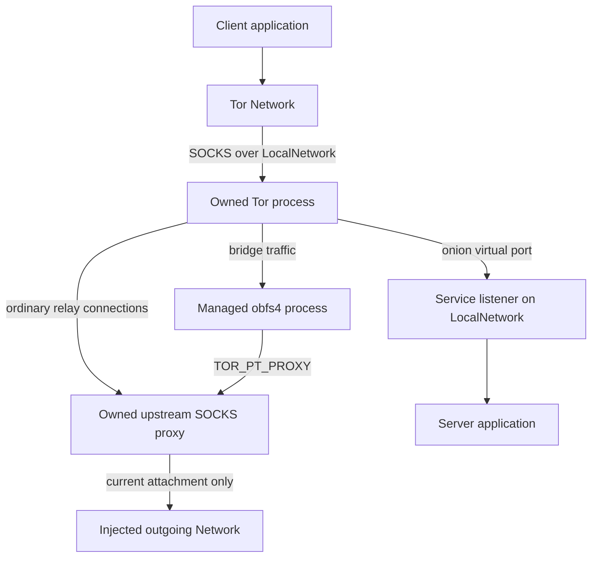

# Architecture

## Scope

One Driver owns one client-mode Tor process, one private work directory, one
control connection, one upstream SOCKS listener, and any number of application
Networks and onion Services. It does not run a relay, expose a raw controller,
merge a user's torrc, or provide a string-based configuration escape hatch.

The Go core creates external resources only through `Dependencies`. The child
process itself necessarily performs its own filesystem and socket operations;
`Processes` is the boundary for replacing or containing that entire execution
environment. Native Tor requires real child-visible files and real loopback
connectivity. Supplying a purely in-memory filesystem or local Network alongside
the native process adapter cannot work.

## Traffic paths

All sockets the Go library creates, including control, Tor SOCKS, upstream proxy
listeners, and onion backing listeners, go through the fixed `LocalNetwork`.
Only the upstream proxy calls the replaceable outgoing Network. Application
hostnames are sent to Tor through SOCKS; Tor relay/bridge destinations presented
to the upstream proxy must be numeric IPv4/IPv6 endpoints. The proxy implements
no resolver, UDP, BIND, or extension commands.

Tor's `Socks5Proxy` controls its relay connections. A managed transport is a
separate process: Tor supplies `TOR_PT_PROXY`, and the transport is responsible
for using it. A conforming transport reports proxy support or failure during
startup. Merely setting Tor's proxy cannot intercept arbitrary sockets created
by a broken transport. This distinction follows the
[managed proxy proposal](https://spec.torproject.org/proposals/232-pluggable-transports-through-proxy.html)
and [PT configuration specification](https://spec.torproject.org/pt-spec/configuration-environment.html).

## Public object model

| Object | Responsibilities | Lifetime |
| --- | --- | --- |
| `Driver` | Process, controller, proxy, typed configuration and child resources | From successful Start to explicit Close or terminal process/control/proxy failure |
| `Network` | TCP client and Tor DNS resolver; SOCKS isolation identity | Independently closable; also closed by Driver |
| `Service` | Ephemeral or stored v3 identity, descriptor readiness, protected discovery, mutable virtual ports, backing listeners and accepted sockets | Independently closable or drainable; also closed by Driver/control loss |
| `Dependencies` | Borrowed external-effect adapters | Must remain usable until Driver.Close returns |
| Outgoing attachment | One generation of a borrowed Network and the sessions established through it | Until replacement, removal, reported closure/down, or configured error latch |

`gonnect.Network` includes operations Tor cannot provide. Both public network
types embed a private alias of `gonnect.RejectNetwork`. They implement the
supported operations and reject the rest. `IsNative` is false, preventing
consumers from treating these networks as permission to use native sockets.

TCP wrappers preserve close tracking. They deliberately do not expose file
descriptors or `SyscallConn`. Socket tuning/half-close methods forward only when
the underlying injected connection supports them. Client `Listen`, service
`Dial`, UDP, packets, multicast and unsupported DNS records remain unavailable.

## Startup

1. Validate and copy all configuration. Reject unknown enum values, control
   characters, nonabsolute executable paths, invalid identities, and malformed
   supported bridge fields. Ignore unsupported bridge transport entries, then
   fail if bridge mode has no accepted bridge.
2. Create a private temporary directory. Use a caller-specified private state
   directory if supplied; otherwise state is inside the temporary directory.
3. Install the initial outgoing attachment, or remain blocked when it is nil or
   already unavailable. Generate independent random proxy username/password.
4. Bind the upstream SOCKS listener on numeric loopback through LocalNetwork.
   Its address and credentials remain fixed throughout the process lifetime.
5. Write an empty defaults file and the generated torrc. Launch Tor directly,
   without a shell, using `--defaults-torrc ... -f ...` and `RunAsDaemon 0`.
   Start with `DisableNetwork 1` and `__OwningControllerProcess` set.
6. Read the owned control-port file and cookie through FileSystem. Connect only
   to the validated loopback endpoint. Require SAFECOOKIE, generate a fresh
   client nonce, validate Tor's HMAC before sending the client proof, and clear
   the read cookie buffer. Ignore PROTOCOLINFO's advertised cookie-file path.
7. Send TAKEOWNERSHIP, then clear `__OwningControllerProcess` as prescribed by
   the [control protocol](https://spec.torproject.org/control-spec/commands.html).
   Query Tor's supported event names and subscribe to bootstrap, onion
   descriptor, and available managed-transport events. Verify GETCONF reports
   the required upstream proxy. Enable networking and discover the single
   loopback Tor SOCKS listener.
8. Return before public-network bootstrap. `WaitReady` separately polls Tor's
   circuit-established status and checks that an outgoing attachment is enabled.

An initial nil outgoing Network therefore allows offline service registration
and later connection without rebuilding Driver. `DisableNetwork` is only a
startup aid; permanent fail-closed behavior comes from the fixed upstream proxy.
There is no configuration path that clears `Socks5Proxy` during replacement.

## Outgoing replacement and failures

A serialized replacement operation detaches the current generation, cancels its
context, closes both halves of its tracked sessions, unregisters lifecycle
callbacks, and then installs the new generation. Each Dial captures exactly one
generation. Resources returned after that generation closes are immediately
closed and are never handed to a Tor proxy session. The injected Dial must honor
its context; the driver can cancel a noncooperating call but cannot forcibly end
arbitrary Go code inside a borrowed adapter.

Replacement does not wait for every borrowed Dial function to return. A function
already entered may complete later; its result is rejected. Application adapters
must check cancellation before starting externally visible work. The rule is
about which sockets may remain usable, not a promise that no previously scheduled
function can execute another instruction after replacement.

Normal connection failure rejects that request with no alternative dialer.
`RetrySameNetwork` allows Tor's ordinary bootstrap retries through the same
attachment. `LatchOutboundErrors` additionally tears down that attachment on
non-cancellation dial/I/O errors. Closure indicated by `net.ErrClosed` from Dial,
`gonnect.CloserSubscriber`, or `gonnect.UpDownSubscriber` tears it down in either
mode. A socket's normal EOF/local close alone does not imply the whole abstract
Network has closed. A failed installation leaves no attachment.

`OutboundState.Available` means attached and not closed/latched; it is not a
reachability probe. Attempts count calls attempted through the gate. Tor can
briefly retain stale circuit-established state after a disconnect, so successful
application I/O is the definitive readiness check after recovery.

## Isolation

Each Network gets 256 bits of injected randomness for its SOCKS isolation
password. Session mode retains that identity; per-connection mode creates a new
identity for every Dial or Tor DNS lookup. The implementation configures
`IsolateSOCKSAuth` and uses `socksgo.WithTorIsolation` with an explicit identity.
It overrides socksgo's loopback bypass filter and installs a nonnil Dialer that
can only reach the owned SOCKS endpoint through LocalNetwork. It never uses the
package's environment-derived or default native dialer.

Isolation partitions circuit eligibility. It does not promise a particular
circuit forever, a different exit IP per connection, or no shared relays.
`MaxCircuitDirtiness` is daemon-wide; `KeepAliveIsolateSOCKSAuth` permits keeping
authenticated circuits while they have live streams. Per-Network circuit-age
policies and explicit circuit attachment are not available. A global NEWNYM
signal would affect other Networks and is not used.

HTTP keep-alive and HTTP/2 can reuse one TCP stream for multiple requests; use
appropriate HTTP transport settings when request-level separation is needed.
An onion hostname is passed directly to Dial, not resolved to a synthetic IP.
The underlying [socksgo API](https://pkg.go.dev/github.com/asciimoth/socksgo)
provides the Tor SOCKS extensions; the Driver wrapper supplies isolation and
lifetime boundaries.

## Onion services

NewService reserves all backing loopback listeners first, then sends a typed
`ADD_ONION` request with numeric port mappings. There is no Detach flag. Tor
returns each generated v3 key once. Driver keeps it only for service lifetime
unless `KeyName` selects the injected `OnionKeyStore`. Stored keys use Tor's
expanded Ed25519 scalar-and-PRF format. The format is not a Go Ed25519 seed;
the public conversion helper hashes and clamps a seed before it creates the
typed key. Store failure causes an acknowledged DEL_ONION before resources are
released.

Protected services add `V3Auth` and typed base32 X25519 public keys. Client-side
access uses ONION_CLIENT_AUTH_ADD/REMOVE with typed private keys. Raw key text is
not logged or included in events. Tor does not report which authorized key made
an accepted stream, so Driver does not claim per-connection client identity.

Close sends DEL_ONION before releasing backing ports, avoiding a live mapping
to a recycled local port. Closing one listener performs an acknowledged
DEL_ONION/ADD_ONION replacement and releases only that backing port. Listen can
reopen the reserved virtual port. It allocates the new listener before the old
mapping changes, so it cannot select a still-mapped endpoint. If Tor rejects the
new map, Driver restores the old map before it returns the error. If deletion,
transport, or rollback is ambiguous, Driver stops Tor before it frees ports.

HS_DESC events update a per-service publication state. WaitPublished is
cancellable and completes on the first UPLOADED event for the current mapping.
A mapping replacement resets it to pending. A failed upload remains observable
but does not end the wait because another directory upload can succeed.

Close immediately closes listeners and accepted connections. Drain withdraws
the service, closes listeners, and waits for accepted connections. If its
context ends, it closes the remaining connections. Service implements
`gonnect.CloserSubscriber`. `MaxStreamsPolicy` controls whether Tor retains or
closes a rendezvous circuit at the configured limit. These lifecycle choices
follow [ADD_ONION/DEL_ONION semantics](https://spec.torproject.org/control-spec/commands.html).

## Controller implementation

The private `internal/control` package implements the small required protocol
subset: bounded multiline replies, asynchronous-event delivery, SAFECOOKIE,
serialization, and typed callers in Driver. It opens no files or sockets itself.
After a command has been sent, cancellation closes the connection so a late reply
cannot be attributed to the next command. With TAKEOWNERSHIP this intentionally
terminates the owned daemon. Cancellation while waiting to send does not do so.

The following alternative client libraries were considered:

- [Stem](https://github.com/torproject/stem) and
  [txtorcon](https://github.com/meejah/txtorcon) provide useful lifecycle/control
  models but are Python libraries.
- [Bine](https://github.com/cretz/bine) is a Go option for a richer controller.
  This package keeps the required subset internal so filesystem, entropy and
  cancellation behavior stay explicit and the public API cannot expose raw
  control/configuration. Replacing this internal package with a reviewed Bine
  adapter is possible without changing the public Driver API.
- [Orc](https://github.com/sycamoreone/orc) is a Go option for partial,
  low-level control-protocol access. It does not supply tor-driver's complete
  lifecycle, injected routing, or onion-service abstraction.

## Privileges and restrictions

The generated configuration forces client-only operation, disables relay and
directory ports, enables safe logging and debugger-attachment restrictions, and
avoids unnecessary disk writes. `NoExec 1` is used when no transport is enabled;
Tor must be allowed to execute a process when managed obfs4 is configured.

Tor's Linux seccomp sandbox currently prohibits new onion services through the
control port. Consequently `DynamicServices` is the default; the explicit
`LinuxSandbox` mode enables `Sandbox 1` and rejects NewService. This package also
rejects managed transports in that mode. There is no silent sandbox downgrade.
These compatibility constraints are documented in the
[Tor manual](https://man.archlinux.org/man/tor.1.en).

| Adapter | Implemented behavior | Boundary |
| --- | --- | --- |
| Linux `System` | Non-root execution; root must request nonzero UID/GID, dropping supplementary groups before exec. Uses a pidfd and a private cgroup when the current cgroup is writable, with process-group fallback. Linux file operations traverse by file descriptor with `openat2` and do not follow symlinks. | Protocol routing only. There is no child network firewall. Same-UID caller retains its existing groups. |
| Linux `ContainedSystem` | Places Tor in a cgroup during clone, before child code runs. An nftables output hook rejects and counts non-loopback IPv4 and IPv6 packets from that cgroup and descendants. `cgroup.kill`, pidfd, and process-group cleanup supervise Tor and PT children. Cleanup keeps the firewall if the cgroup is not confirmed empty. | Requires a cgroup v2 parent in which the caller can create a child but the Tor identity cannot migrate to the parent. It also requires `cgroup.kill`, nftables, and network-administration privilege. It is single-use and Linux-only. |
| Windows `System` | Atomically creates directories with a private DACL for caller and SYSTEM; creates Tor suspended, assigns a kill-on-close Job Object, and resumes its initial thread. Nested Jobs contain PT children. | Protocol routing only. Run under an ordinary account. |
| Windows `ContainedSystem` | Disables unnecessary child-token privileges and installs outbound Windows Firewall rules for approved Tor/PT executable paths before launch. It verifies the active firewall profiles and effective rules. Cleanup keeps the rules until process exit is confirmed. | Requires elevation to manage firewall rules. Every active profile must enable Windows Firewall and local rules. External IPv4, IPv6, and DNS are blocked; loopback remains available. |
| `BestEffortSystem` | Resolves missing executables, selects `nobody` for a root Linux caller, and tries the platform `ContainedSystem`. It preserves explicit paths and identities. | Falls back to `System` when strict containment is unavailable. The report and logger expose the fallback. It is not suitable when containment is mandatory. |
| Both | Direct execution; limited inherited environment, cookie auth, ownership, output gating and no user torrc. | Trusted Tor/PT binaries and trustworthy adapters; local TCP alone does not isolate other processes under the same account. |

The contained firewall permits loopback because Tor must accept control and
SOCKS connections, connect to runtime onion backing ports, and communicate with
managed PT listeners and the upstream proxy. Thus, it prevents external socket
escape but does not isolate the child from other local loopback services. The
proxy runs outside the child cgroup and reaches the external network only through
the injected outgoing Network. `Stats` reports rejected IPv4 and IPv6 packets.

The ordinary adapter tries cgroup placement only when its current cgroup is
writable. It always requests a pidfd from kernels that support one and retains
process-group cleanup as a compatibility fallback. Windows uses documented
thread enumeration and resume APIs after suspended Job assignment. Native tests
run the adapter inside another adapter Job and verify descendant cleanup.
Driver waits for process reaping before deleting its work directory; failure to
reap returns a cleanup error and retains the files.

The obfs4 whitelist identifies the protocol/configuration path, not the binary's
contents. Executable provenance and a tested obfs4 version remain deployment
responsibilities. `direct.FindExecutables` is an opt-in host adapter that finds
missing paths by name. It does not validate binary contents or enable a
transport. `BestEffortSystem` calls the same resolver before it selects process
protection. Snowflake, meek, webtunnel and arbitrary managed or external SOCKS
transports are rejected until specifically implemented and tested.

The Linux contained adapter is separate from Tor's syscall sandbox. The normal
adapter's routing rules cover conforming trusted processes only. Windows uses a
restricted-token and firewall boundary. Executable paths remain trusted
configuration. Strict Linux containment rejects a parent when a non-root caller
can write its `cgroup.procs` file. A root caller must also select a non-root Tor
identity. These checks prevent the child from moving itself out of the filtered
cgroup.

## Ownership and shutdown

Start's context bounds startup, not the returned Driver's lifetime. Close is
idempotent and concurrent-safe. It blocks outgoing traffic first, closes all
application resources, requests Tor shutdown, closes control, waits, and then
kills/reaps the process tree if necessary. Several bounded waits can each take
ShutdownTimeout. Adapter Close operations and log callbacks must return promptly.

Control loss, unexpected child exit, or an unexpected proxy-listener stop makes
the Driver terminal and triggers the same cleanup. There is no implicit restart
that would silently lose service identities or change application lifetimes.
An outgoing-network failure alone is recoverable with SetOutbound.

Driver never closes borrowed Networks or Logger. Optional close subscriptions
are removed when their attachment retires. A persistent StateDirectory remains
caller-owned and is not deleted. Temporary cookie, torrc, credentials, and
disposable state are removed after child reaping; abnormal host termination can
leave stale directories for application-managed cleanup. `Close` reports a
graceful-shutdown timeout even when the forced kill and reap succeed. It also
joins observable socket, process-release, and temporary-file cleanup errors.

Driver emits bounded operational logs without raw control requests, cookies,
bridge descriptors or onion private keys. Forwarding Tor's stdout/stderr is
opt-in. The forwarding path redacts generated proxy credentials, typed bridge
fields, executable paths, and recognized onion-key tokens. It also retains
Tor's own SafeLogging behavior, but it can contain other local metadata.
`BestEffortSystem` separately writes its host-preparation decisions at debug
level. Those direct-adapter messages include selected executable paths and
UID/GID values so operators can audit automatic choices. Applications must
suppress debug output when that local metadata is sensitive.

`Start` returns a typed `StartupError` with its original error. Driver
subscriptions retain at most 32 recent typed events, and each subscriber buffer
is limited to 1–1024 events. Outgoing diagnostics contain only a fixed failure
category, generation, and latch state. Shutdown diagnostics contain only a
fixed cleanup stage. Raw backend errors and destinations are available only
through the direct operation error, not through these shared events.

The exact requested Logger interface is in `api.go`. Driver never invokes its
Fatal methods, and the direct Logger never exits the host process.
