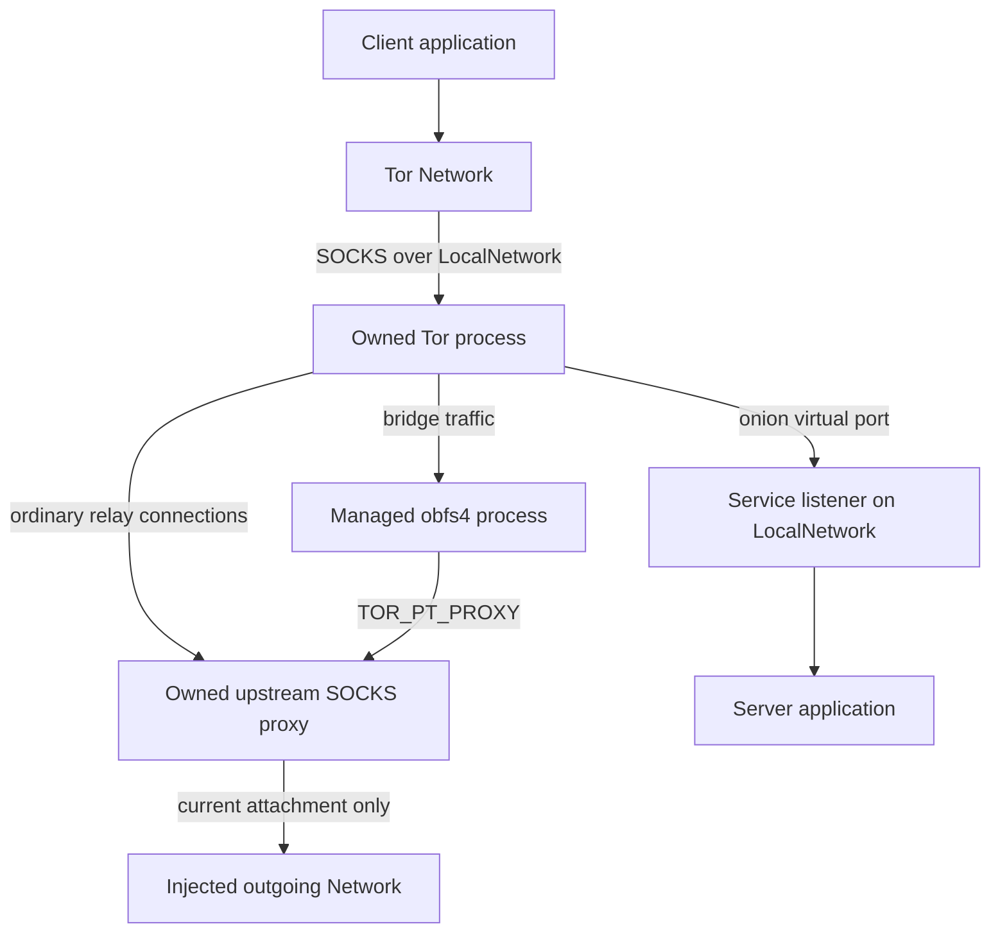

# Architecture

## Scope

One Driver owns one client-mode Tor process, one private work directory, one
control connection, one upstream SOCKS listener, and any number of application
Networks and onion Services. It does not run a relay, expose a raw controller,
merge a user's torrc, or provide a string-based configuration escape hatch.

The Go core creates external resources only through `Dependencies`. The child
process itself necessarily performs its own filesystem and socket operations;
`Processes` is the boundary for replacing or containing that entire execution
environment. Native Tor requires real child-visible files and real loopback
connectivity. Supplying a purely in-memory filesystem or local Network alongside
the native process adapter cannot work.

## Traffic paths

All sockets the Go library creates, including control, Tor SOCKS, upstream proxy
listeners, and onion backing listeners, go through the fixed `LocalNetwork`.
Only the upstream proxy calls the replaceable outgoing Network. Application
hostnames are sent to Tor through SOCKS; Tor relay/bridge destinations presented
to the upstream proxy must be numeric IPv4/IPv6 endpoints. The proxy implements
no resolver, UDP, BIND, or extension commands.

Tor's `Socks5Proxy` controls its relay connections. A managed transport is a
separate process: Tor supplies `TOR_PT_PROXY`, and the transport is responsible
for using it. A conforming transport reports proxy support or failure during
startup. Merely setting Tor's proxy cannot intercept arbitrary sockets created
by a broken transport. This distinction follows the
[managed proxy proposal](https://spec.torproject.org/proposals/232-pluggable-transports-through-proxy.html)
and [PT configuration specification](https://spec.torproject.org/pt-spec/configuration-environment.html).

## Public object model

| Object | Responsibilities | Lifetime |
| --- | --- | --- |
| `Driver` | Process, controller, proxy, typed configuration and child resources | From successful Start to explicit Close or terminal process/control/proxy failure |
| `Network` | TCP client and Tor DNS resolver; SOCKS isolation identity | Independently closable; also closed by Driver |
| `Service` | Ephemeral v3 identity, reserved virtual ports, backing listeners and accepted sockets | Independently closable; also closed by Driver/control loss |
| `Dependencies` | Borrowed external-effect adapters | Must remain usable until Driver.Close returns |
| Outgoing attachment | One generation of a borrowed Network and the sessions established through it | Until replacement, removal, reported closure/down, or configured error latch |

`gonnect.Network` includes operations Tor cannot provide. Both public network
types embed a private alias of `gonnect.RejectNetwork`. They implement the
supported operations and reject the rest. `IsNative` is false, preventing
consumers from treating these networks as permission to use native sockets.

TCP wrappers preserve close tracking. They deliberately do not expose file
descriptors or `SyscallConn`. Socket tuning/half-close methods forward only when
the underlying injected connection supports them. Client `Listen`, service
`Dial`, UDP, packets, multicast and unsupported DNS records remain unavailable.

## Startup

1. Validate and copy all configuration. Reject unknown enum values, control
   characters, nonabsolute executable paths, invalid identities, and malformed
   supported bridge fields. Ignore unsupported bridge transport entries, then
   fail if bridge mode has no accepted bridge.
2. Create a private temporary directory. Use a caller-specified private state
   directory if supplied; otherwise state is inside the temporary directory.
3. Install the initial outgoing attachment, or remain blocked when it is nil or
   already unavailable. Generate independent random proxy username/password.
4. Bind the upstream SOCKS listener on numeric loopback through LocalNetwork.
   Its address and credentials remain fixed throughout the process lifetime.
5. Write an empty defaults file and the generated torrc. Launch Tor directly,
   without a shell, using `--defaults-torrc ... -f ...` and `RunAsDaemon 0`.
   Start with `DisableNetwork 1` and `__OwningControllerProcess` set.
6. Read the owned control-port file and cookie through FileSystem. Connect only
   to the validated loopback endpoint. Require SAFECOOKIE, generate a fresh
   client nonce, validate Tor's HMAC before sending the client proof, and clear
   the read cookie buffer. Ignore PROTOCOLINFO's advertised cookie-file path.
7. Send TAKEOWNERSHIP, then clear `__OwningControllerProcess` as prescribed by
   the [control protocol](https://spec.torproject.org/control-spec/commands.html).
   Verify GETCONF reports the required upstream proxy. Enable networking and
   discover the single loopback Tor SOCKS listener.
8. Return before public-network bootstrap. `WaitReady` separately polls Tor's
   circuit-established status and checks that an outgoing attachment is enabled.

An initial nil outgoing Network therefore allows offline service registration
and later connection without rebuilding Driver. `DisableNetwork` is only a
startup aid; permanent fail-closed behavior comes from the fixed upstream proxy.
There is no configuration path that clears `Socks5Proxy` during replacement.

## Outgoing replacement and failures

A serialized replacement operation detaches the current generation, cancels its
context, closes both halves of its tracked sessions, unregisters lifecycle
callbacks, and then installs the new generation. Each Dial captures exactly one
generation. Resources returned after that generation closes are immediately
closed and are never handed to a Tor proxy session. The injected Dial must honor
its context; the driver can cancel a noncooperating call but cannot forcibly end
arbitrary Go code inside a borrowed adapter.

Replacement does not wait for every borrowed Dial function to return. A function
already entered may complete later; its result is rejected. Application adapters
must check cancellation before starting externally visible work. The rule is
about which sockets may remain usable, not a promise that no previously scheduled
function can execute another instruction after replacement.

Normal connection failure rejects that request with no alternative dialer.
`RetrySameNetwork` allows Tor's ordinary bootstrap retries through the same
attachment. `LatchOutboundErrors` additionally tears down that attachment on
non-cancellation dial/I/O errors. Closure indicated by `net.ErrClosed` from Dial,
`gonnect.CloserSubscriber`, or `gonnect.UpDownSubscriber` tears it down in either
mode. A socket's normal EOF/local close alone does not imply the whole abstract
Network has closed. A failed installation leaves no attachment.

`OutboundState.Available` means attached and not closed/latched; it is not a
reachability probe. Attempts count calls attempted through the gate. Tor can
briefly retain stale circuit-established state after a disconnect, so successful
application I/O is the definitive readiness check after recovery.

## Isolation

Each Network gets 256 bits of injected randomness for its SOCKS isolation
password. Session mode retains that identity; per-connection mode creates a new
identity for every Dial or Tor DNS lookup. The implementation configures
`IsolateSOCKSAuth` and uses `socksgo.WithTorIsolation` with an explicit identity.
It overrides socksgo's loopback bypass filter and installs a nonnil Dialer that
can only reach the owned SOCKS endpoint through LocalNetwork. It never uses the
package's environment-derived or default native dialer.

Isolation partitions circuit eligibility. It does not promise a particular
circuit forever, a different exit IP per connection, or no shared relays.
`MaxCircuitDirtiness` is daemon-wide; `KeepAliveIsolateSOCKSAuth` permits keeping
authenticated circuits while they have live streams. Per-Network circuit-age
policies and explicit circuit attachment are future features. A global NEWNYM
signal would affect other Networks and is not used.

HTTP keep-alive and HTTP/2 can reuse one TCP stream for multiple requests; use
appropriate HTTP transport settings when request-level separation is needed.
An onion hostname is passed directly to Dial, not resolved to a synthetic IP.
The underlying [socksgo API](https://pkg.go.dev/github.com/asciimoth/socksgo)
provides the Tor SOCKS extensions; the Driver wrapper supplies isolation and
lifetime boundaries.

## Onion services

NewService reserves all backing loopback listeners first, then sends a typed
`ADD_ONION NEW:ED25519-V3 Flags=DiscardPK` request with numeric port mappings.
There is no Detach flag. Keys are generated and retained only by Tor; the control
reply does not return private key material. A Service itself is the requested
listen-only gonnect.Network and exposes its onion hostname.

Close sends DEL_ONION before releasing backing ports, avoiding a live mapping
to a recycled local port. If service deletion cannot be confirmed, the Driver
shuts down Tor before freeing those ports. A transport failure during ADD_ONION
also closes Driver because success may be ambiguous. A normal Tor rejection
does not by itself terminate Driver.

For this starter, closing any Service listener closes the entire Service, and
each reserved port may be claimed once. There is no persistent key API, client
authorization, mutable port map or publication-event subscription yet. The
example retries a request to handle descriptor propagation. These lifecycle
choices follow [ADD_ONION/DEL_ONION semantics](https://spec.torproject.org/control-spec/commands.html).

## Controller implementation

The private `internal/control` package implements the small required protocol
subset: bounded multiline replies, asynchronous-event skipping, SAFECOOKIE,
serialization, and typed callers in Driver. It opens no files or sockets itself.
After a command has been sent, cancellation closes the connection so a late reply
cannot be attributed to the next command. With TAKEOWNERSHIP this intentionally
terminates the owned daemon. Cancellation while waiting to send does not do so.

The supplied client libraries were considered:

- [Stem](https://github.com/torproject/stem) and
  [txtorcon](https://github.com/meejah/txtorcon) provide useful lifecycle/control
  models but are Python libraries.
- [Bine](https://github.com/cretz/bine) is a Go option for a richer controller.
  This starter keeps the required subset internal so filesystem, entropy and
  cancellation behavior stay explicit and the public API cannot expose raw
  control/configuration. Replacing this internal package with a reviewed Bine
  adapter is possible without changing the public Driver API.

The tradeoff is that the new parser needs independent testing and fuzzing before
a production release. Included protocol tests are not a substitute for that.

## Privileges and restrictions

The generated configuration forces client-only operation, disables relay and
directory ports, enables safe logging and debugger-attachment restrictions, and
avoids unnecessary disk writes. `NoExec 1` is used when no transport is enabled;
Tor must be allowed to execute a process when managed obfs4 is configured.

Tor's Linux seccomp sandbox currently prohibits new onion services through the
control port. Consequently `DynamicServices` is the default; the explicit
`LinuxSandbox` mode enables `Sandbox 1` and rejects NewService. This starter also
rejects managed transports in that mode. There is no silent sandbox downgrade.
These compatibility constraints are documented in the
[Tor manual](https://man.archlinux.org/man/tor.1.en).

| Adapter | Implemented behavior | Boundary |
| --- | --- | --- |
| Linux | Non-root execution; root must request nonzero UID/GID, dropping supplementary groups before exec. Private modes, process group, graceful Tor shutdown then group kill. | No network namespace, cgroup, pidfd supervision or privilege-escalation syscall filter. Same-UID caller retains its existing groups. |
| Windows | Private directory DACL for caller and SYSTEM; create suspended, assign kill-on-close Job Object, resume; Job contains PT children. | Uses caller token; no restricted token or AppContainer yet. Run under an ordinary account. |
| Both | Direct execution; limited inherited environment, cookie auth, ownership, output gating and no user torrc. | Trusted Tor/PT binaries and trustworthy adapters; local TCP alone does not isolate other processes under the same account. |

Linux group IDs could theoretically be recycled between parent reaping and group
cleanup; a hardened adapter should use stronger process supervision. Windows
uses NtResumeProcess after suspended Job assignment and needs real-platform
integration validation. Driver waits for process reaping before deleting its
work directory; failure to reap returns a cleanup error and retains the files.

The obfs4 whitelist identifies the protocol/configuration path, not the binary's
contents. Executable provenance and a tested obfs4 version remain deployment
responsibilities. Snowflake, meek, webtunnel and arbitrary managed or external
SOCKS transports are rejected until specifically implemented and tested.

For an enforceable boundary against unexpected Tor/PT socket creation, implement
a stronger Processes adapter: Linux network-namespace/firewall or Windows
AppContainer/WFP containment, permitting only the required local endpoints.
This is separate from Tor's own syscall sandbox. The current routing rules cover
conforming trusted processes; they cannot prove the absence of every direct
socket from a hostile child executable.

## Ownership and shutdown

Start's context bounds startup, not the returned Driver's lifetime. Close is
idempotent and concurrent-safe. It blocks outgoing traffic first, closes all
application resources, requests Tor shutdown, closes control, waits, and then
kills/reaps the process tree if necessary. Several bounded waits can each take
ShutdownTimeout. Adapter Close operations and log callbacks must return promptly.

Control loss, unexpected child exit, or an unexpected proxy-listener stop makes
the Driver terminal and triggers the same cleanup. There is no implicit restart
that would silently lose service identities or change application lifetimes.
An outgoing-network failure alone is recoverable with SetOutbound.

Driver never closes borrowed Networks or Logger. Optional close subscriptions
are removed when their attachment retires. A persistent StateDirectory remains
caller-owned and is not deleted. Temporary cookie, torrc, credentials, and
disposable state are removed after child reaping; abnormal host termination can
leave stale directories for application-managed cleanup.

Driver emits bounded operational logs without raw control requests, cookies,
bridge descriptors or onion private keys. Forwarding Tor's stdout/stderr is
opt-in and retains Tor's own SafeLogging behavior; it can contain local metadata.
The exact requested Logger interface is in `api.go`. Driver never invokes its
Fatal methods, and the direct Logger never exits the host process.
